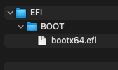
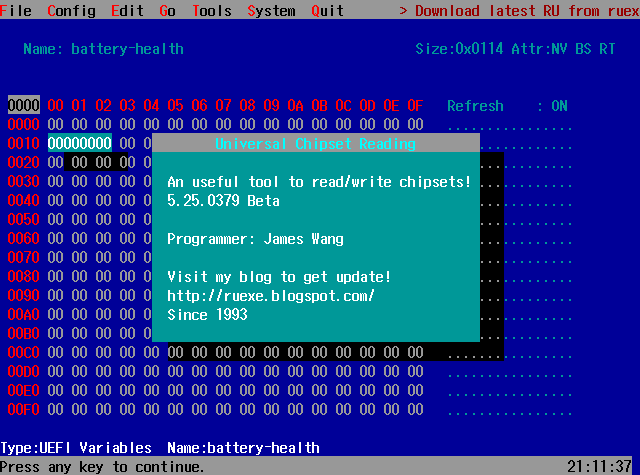
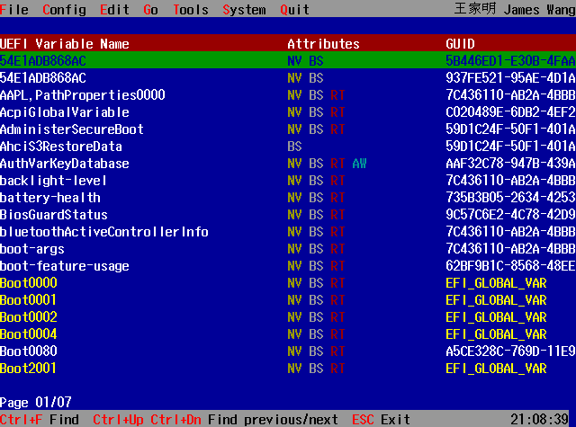
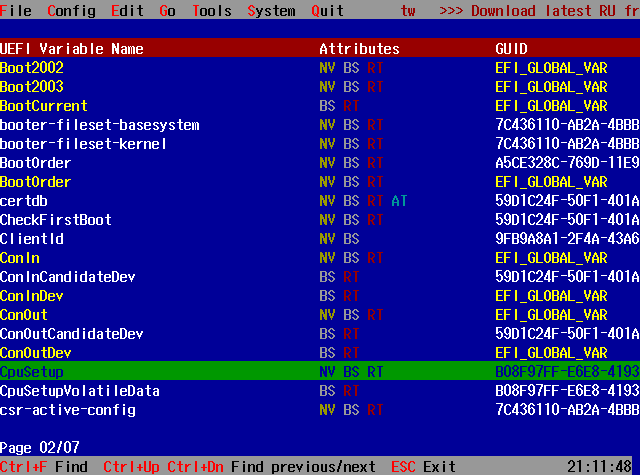
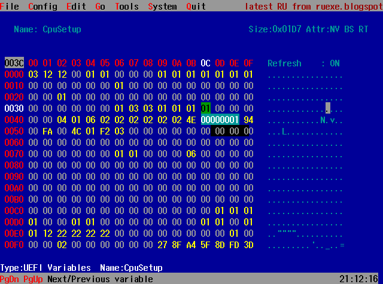
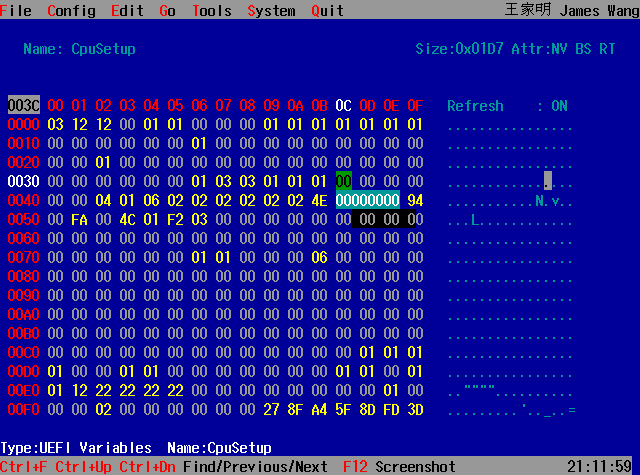

# Disabling CFG Lock for Enhanced macOS Compatibility on Intel NUC: A Comprehensive Guide

## Introduction

CFG-Lock is a BIOS setting that controls whether a specific register (in this case, the MSR 0xE2) can be written to. By
default, many motherboards lock this variable, with some even hiding the option in the GUI. This is particularly
relevant for macOS users, as both the Kernel (XNU) and AppleIntelPowerManagement components of macOS require write
access to this register.

Disabling CFG Lock can thus be crucial for running macOS smoothly on non-Apple hardware, offering two main benefits:

1. **Avoiding Instability and Unnecessary Patching**: By disabling CFG Lock, you eliminate the need for patches that
   make macOS compatible with your hardware, such as `AppleCpuPmCfgLock` for `AppleIntelPowerManagement.kext`
   and `AppleXcpmCfgLock` for the Kernel (XNU). These patches can introduce instability and complicate OS updates.

2. **Enhancing System Performance and Stability for macOS**: Disabling CFG Lock in the firmware itself is the preferred
   method, as it allows macOS to write to MSR E2 directly, ensuring better system stability and performance, as well as
   easier upgrades to newer versions of the OS.

This document provides a step-by-step guide on how to disable the CFG Lock on an Intel NUC using the RU software. The
process involves downloading the RU software, preparing a USB drive, and modifying UEFI variables.

## Downloading RU Software

1. Visit the RU software download page at [http://ruexe.blogspot.com/](http://ruexe.blogspot.com/).
2. Download the software to your local machine.

## Preparing the USB Drive

1. Ensure you have a USB drive with at least 100 MB of free space. The USB drive must be empty.
2. Format the USB drive as MBR, using the FAT32 file system.
3. Create a folder structure on the USB drive as follows:
    - First, create a folder named `EFI`.
    - Inside the `EFI` folder, create another folder named `BOOT`.
    - In the `BOOT` folder, paste the downloaded `RU.efi` file and rename it to `bootx64.efi`.

   The final file structure on your USB drive should be:

```
YOUR_USB_DRIVE/EFI/BOOT/bootx64.efi
```



## Booting from the USB Drive

1. Disable Secure Boot in your computer's BIOS.

2. Boot your computer from the USB drive.

3. Upon booting, you will be greeted with a screen. Simply press Enter to proceed.

   

4. To access the UEFI variable editor, press `ALT + =` on an ANSI layout keyboard, or `ALT + ¡` on an ISO layout
   keyboard.



## Disabling CFG Lock

1. Use the navigation bar at the top of the RU software interface to find the "CPUSetup" variable.

2. Once you find "CPUSetup", press Enter to access its settings.

   

3. Locate the value set to `01`, which indicates that the CFG Lock is enabled. You will change this value to `00` to
   disable the CFG Lock. Note: The offset `0x3C` is specific to the guide's author's PC; your specific offset may vary.

   

4. Enter `0` to change the value, and press Enter to confirm your edit. This action should highlight the new value,
   indicating the change.

   

5. Press `Ctrl + W` to save your changes, and `ALT + Q` to exit the RU software.

6. Turn off your computer to complete the process.

## Verifying CFG Lock Status

To ensure the CFG Lock has been successfully disabled, you can use the VerifyMsrE2 tool. Remember, BIOS updates may
alter the specific values or their locations within the UEFI settings.


## Conclusion

Disabling the CFG Lock on an Intel NUC can potentially enhance system performance. This guide has walked you through the
process of downloading the necessary software, preparing a bootable USB drive, and adjusting UEFI settings to disable
the CFG Lock.
